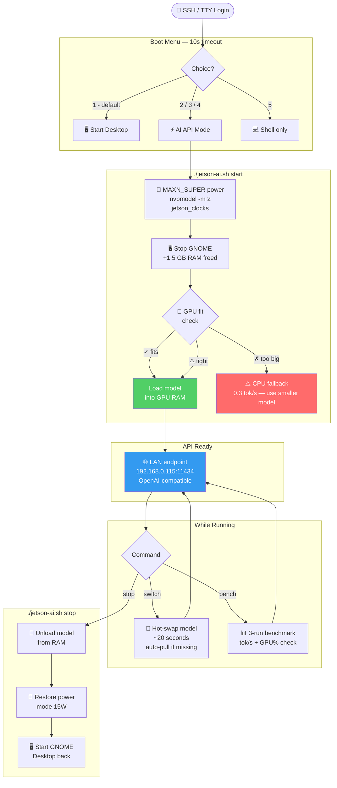

# Jetson Orin 8GB — Headless AI API

Run local LLMs as a **LAN API endpoint** on NVIDIA Jetson Orin 8GB.  
Switch between headless AI mode and normal Ubuntu desktop with one command.

**Hardware:** Jetson Orin Nano 8GB · LPDDR5 68 GB/s · CUDA 12.6 · JetPack 6.x  
**Backend:** [Ollama](https://ollama.com) · OpenAI-compatible REST API

---

## Table of Contents
- [Architecture](#architecture)
- [Memory Layout](#memory-layout)
- [Mode Flow](#mode-flow)
- [Quick Start](#quick-start)
- [Model Guide](#model-guide)
- [Optimization Stack](#optimization-stack)
- [API Usage](#api-usage)
- [Boot Menu](#boot-menu)
- [Test Suite](#test-suite)
- [Troubleshooting](#troubleshooting)

---

## Architecture

```
╔═══════════════════════════════════════════════════════════════════╗
║                    YOUR HOME / LAB NETWORK                        ║
║                                                                   ║
║  ┌────────────────────────────────────────────────────────────┐  ║
║  │              NVIDIA JETSON ORIN  8GB                       │  ║
║  │                                                            │  ║
║  │  ┌─────────────────────────────────────────────────────┐  │  ║
║  │  │  Ampere GPU (1024 CUDA cores)                       │  │  ║
║  │  │  ◄──────────────────────────────────────────────►   │  │  ║
║  │  │  ARM Cortex-A78AE  6-core CPU   MAXN_SUPER mode     │  │  ║
║  │  └───────────────────────┬─────────────────────────────┘  │  ║
║  │                          │                                 │  ║
║  │  ╔═══════════════════════▼═══════════════════════════╗    │  ║
║  │  ║      Unified LPDDR5 RAM — 8 GB  @  68 GB/s        ║    │  ║
║  │  ║  ┌────────┬──────────────────────┬────────────┐   ║    │  ║
║  │  ║  │OS 0.5G │  Model weights 2–7GB │  KV cache  │   ║    │  ║
║  │  ║  └────────┴──────────────────────┴────────────┘   ║    │  ║
║  │  ╚═══════════════════════════════════════════════════╝    │  ║
║  │                                                            │  ║
║  │  ┌──────────────────────────────────────────────────┐     │  ║
║  │  │  ollama serve  →  0.0.0.0:11434                  │     │  ║
║  │  │  ├── /api/generate          ollama native         │     │  ║
║  │  │  ├── /v1/chat/completions   OpenAI-compatible     │     │  ║
║  │  │  └── /api/ps                model status          │     │  ║
║  │  └──────────────────────────────────────────────────┘     │  ║
║  │                     192.168.0.115:11434                    │  ║
║  └────────────────────────────────────────────────────────────┘  ║
║                              │                                    ║
║          ┌───────────────────┼──────────────────┐                ║
║          ▼                   ▼                  ▼                ║
║   ┌─────────────┐    ┌─────────────┐    ┌────────────┐          ║
║   │Raspberry Pi │    │   Laptop    │    │ Any Device │          ║
║   │192.168.0.148│    │             │    │            │          ║
║   │ curl/Python │    │ OpenAI SDK  │    │HTTP client │          ║
║   └─────────────┘    └─────────────┘    └────────────┘          ║
╚═══════════════════════════════════════════════════════════════════╝
```

---

## Memory Layout

The Jetson uses **unified memory** — CPU and GPU share the same physical pool.  
Stopping the desktop frees 1.5 GB, allowing larger models to run fully on GPU.

```
  ┌─────────────────────────────────────────────────────────────┐
  │                  8 GB Unified RAM                           │
  ├─────────────────────────────────────────────────────────────┤
  │                                                             │
  │  NORMAL MODE  (desktop running)                             │
  │  ┌──────┬──────────┬──────────────────────────────────┐    │
  │  │  OS  │  GNOME   │       Model space                │    │
  │  │ 0.5G │  1.5 GB  │         ~ 6.0 GB free            │    │
  │  └──────┴──────────┴──────────────────────────────────┘    │
  │                                                             │
  │  HEADLESS MODE  (./jetson-ai.sh start)                      │
  │  ┌──────┬──────────────────────────────────────────────┐    │
  │  │  OS  │             Model space                      │    │
  │  │ 0.5G │               ~ 7.1 GB free                  │    │
  │  └──────┴──────────────────────────────────────────────┘    │
  │          ▲ +1.5 GB gained by stopping desktop               │
  └─────────────────────────────────────────────────────────────┘

  ⚠  Silent CPU Fallback Trap:
     Model too big for GPU  →  Ollama silently uses CPU
     GPU inference:  13–35 tok/s  ✓
     CPU inference:   0.3 tok/s  ✗  (100× slower, unusable)
     The bench command detects and warns about this automatically.
```

---

## Mode Flow



---

## Quick Start

```bash
# 1. First-time setup — run once (needs sudo password)
./jetson-ai.sh setup

# 2. Start headless AI API
./jetson-ai.sh start               # default: qwen3.5:4b
./jetson-ai.sh start reasoning     # phi4-mini (task alias)
./jetson-ai.sh start quality       # llama3.1:8b (headless only)

# 3. Swap model on the fly — no restart needed
./jetson-ai.sh switch code         # → qwen3.5:4b
./jetson-ai.sh switch fast         # → phi4-mini
./jetson-ai.sh switch vision       # → gemma4:e2b

# 4. Benchmark
./jetson-ai.sh bench

# 5. Restore Ubuntu desktop
./jetson-ai.sh stop
```

---

## Model Guide

```
  MODEL SELECTION — RAM vs 8 GB LIMIT
  ════════════════════════════════════════════════════════
                                              headless
                                    desktop   only
  qwen3.5:0.8b  ██░░░░░░░░░░░░░░  1.0GB  ~35 tok/s  ✓
  qwen2.5:3b    █████░░░░░░░░░░░  1.9GB  ~22 tok/s  ✓
  llama3.2:3b   █████░░░░░░░░░░░  2.0GB  ~20 tok/s  ✓
  phi4-mini   ★ ██████░░░░░░░░░░  2.5GB  ~18 tok/s  ✓
  gemma3        █████████░░░░░░░  3.3GB  ~12 tok/s  ✓
  qwen3.5:4b  ★ █████████░░░░░░░  3.4GB  ~13 tok/s  ✓
  llama3.1:8b   █████████████░░░  4.9GB  ~ 8 tok/s  ○
  gemma4:e2b    ████████████████  7.2GB  ~ 5 tok/s  ○
  gemma4:e4b    ██████████████████████  9.6GB  ✗ too large
                ├────────┬───────┼───────────────────┤
                0       2GB    4GB                  8GB
                         ▲ desktop  ▲ headless limit
                         6GB free   7.1GB free

  ✓ fits always   ○ headless only   ✗ avoid (CPU fallback)
  ★ recommended
```

### Task Aliases

| Alias | Model | Why |
|---|---|---|
| `default` | qwen3.5:4b | Best quality/speed balance |
| `fast` | phi4-mini | Lowest latency |
| `reasoning` | phi4-mini | Math, logic, step-by-step |
| `code` | qwen3.5:4b | Coding & debugging |
| `vision` | gemma4:e2b | Image understanding |
| `german` | cas/discolm-german | German language |
| `tiny` | qwen2.5:3b | Minimal RAM, fast |
| `quality` | llama3.1:8b | Best output (headless only) |

---

## Optimization Stack

```
  ╔══════════════════════════════════════════════════════════════╗
  ║               SPEED OPTIMIZATION STACK                       ║
  ╠══════════════════════════════════════════════════════════════╣
  ║                                                              ║
  ║  BEFORE  (defaults)                                          ║
  ║  ┌──────────────────────────────────────────────────────┐   ║
  ║  │ 15W mode · GNOME running · 5-min evict · no flash    │   ║
  ║  │ ~6 GB free · ~4–6 tok/s · CPU fallback risk: HIGH   │   ║
  ║  └──────────────────────────────────────────────────────┘   ║
  ║                           ▼                                  ║
  ║  ➊  MAXN_SUPER power      nvpmodel -m 2 + jetson_clocks      ║
  ║     └─ 2× faster GPU/CPU clocks, uncapped power budget       ║
  ║                           ▼                                  ║
  ║  ➋  Stop GNOME desktop    systemctl stop gdm3                ║
  ║     └─ +1.5 GB RAM freed for model weights                   ║
  ║                           ▼                                  ║
  ║  ➌  Flash Attention       OLLAMA_FLASH_ATTENTION=1           ║
  ║     └─ −30 to 50% KV cache memory (CUDA optimized)          ║
  ║                           ▼                                  ║
  ║  ➍  KV cache quant        OLLAMA_KV_CACHE_TYPE=q8_0          ║
  ║     └─ halves KV cache RAM, negligible quality loss          ║
  ║                           ▼                                  ║
  ║  ➎  Model pinned          OLLAMA_KEEP_ALIVE=-1               ║
  ║     └─ 0 s reload delay between requests                     ║
  ║                           ▼                                  ║
  ║  ➏  Systemd drop-in       /etc/systemd/system/ollama.d/      ║
  ║     └─ settings persist across reboots & service restarts    ║
  ║                           ▼                                  ║
  ║  AFTER   (./jetson-ai.sh start)                              ║
  ║  ┌──────────────────────────────────────────────────────┐   ║
  ║  │ MAXN mode · headless · model pinned · flash attn on  │   ║
  ║  │ ~7 GB free · 12–35 tok/s · CPU fallback risk: LOW   │   ║
  ║  └──────────────────────────────────────────────────────┘   ║
  ╚══════════════════════════════════════════════════════════════╝
```

---

## API Usage

The API is fully OpenAI-compatible — works as a drop-in for existing apps.

### Python — OpenAI SDK
```python
from openai import OpenAI

client = OpenAI(
    base_url="http://192.168.0.115:11434/v1",
    api_key="ollama"          # any string, not validated
)
response = client.chat.completions.create(
    model="qwen3.5:4b",
    messages=[{"role": "user", "content": "Explain edge AI in 2 sentences."}]
)
print(response.choices[0].message.content)
```

### Python — requests (streaming)
```python
import requests, json

with requests.post("http://192.168.0.115:11434/api/generate",
    json={"model": "qwen3.5:4b", "prompt": "Count to 5", "stream": True},
    stream=True) as r:
    for line in r.iter_lines():
        if line:
            print(json.loads(line).get("response", ""), end="", flush=True)
```

### curl
```bash
curl http://192.168.0.115:11434/api/generate \
  -d '{"model":"qwen3.5:4b","prompt":"Hello!","stream":false}'
```

### From Raspberry Pi (192.168.0.148)
```bash
curl http://192.168.0.115:11434/v1/chat/completions \
  -H "Content-Type: application/json" \
  -d '{"model":"qwen3.5:4b","messages":[{"role":"user","content":"Hi!"}]}'
```

---

## Boot Menu

Add to `~/.bashrc` to get a mode selector on every login:

```bash
echo 'source ~/gamma4_models/boot-choice.sh' >> ~/.bashrc
```

```
  ╔══════════════════════════════════════════════╗
  ║         JETSON ORIN — BOOT MODE              ║
  ╠══════════════════════════════════════════════╣
  ║  [1] Ubuntu Desktop              ← last      ║
  ║  [2] AI API  — qwen3.5:4b                    ║
  ║  [3] AI API  — phi4-mini (fast)              ║
  ║  [4] AI API  — choose model                  ║
  ║  [5] Shell only (no desktop/AI)              ║
  ╚══════════════════════════════════════════════╝

  Auto-starting [1] in 10s ... (press 1-5 to change)
```

- Remembers your last choice
- Skip for one session: `JETSON_AI_SKIP_MENU=1 bash`
- Skipped automatically inside desktop sessions

---

## Test Suite

Auto-detects all installed models, runs 2-prompt benchmark each, checks GPU placement:

```bash
./test-models.sh            # test all installed models
./test-models.sh phi4-mini  # test one specific model
```

```
  Jetson AI — Model Test Suite
  Date  : 2026-05-21 12:00
  Power : MAXN_SUPER
  RAM   : 7.0G free
  Models: 5 to test
  ────────────────────────────────────────────────────────────
  Model                               Result
  ────────────────────────────────────────────────────────────
  qwen2.5:3b                          ✓ PASS  22.1 tok/s  GPU:94%  1.9GB
  phi4-mini:latest                    ✓ PASS  18.3 tok/s  GPU:91%  2.5GB
  qwen3.5:4b                          ✓ PASS  13.1 tok/s  GPU:88%  3.4GB
  gemma4:e2b                          ⚠ WARN  slow (4.8 tok/s, GPU:42%)
  gemma4:e4b                          ✗ FAIL  CPU fallback (0.3 tok/s, GPU:0%)
  ────────────────────────────────────────────────────────────
  ✓ 3 passed    ⚠ 1 warning    ✗ 1 failed
```

---

## Troubleshooting

| Problem | Symptom | Fix |
|---|---|---|
| `sudo: password required` | Scripts pause/fail | Run `./jetson-ai.sh setup` first |
| CPU fallback | `bench` shows < 2 tok/s | Run `stop` then `start` (stops desktop) |
| Model load timeout | `start` hangs >90s | Try smaller model: `phi4-mini` |
| Desktop doesn't restore | Black screen after `stop` | `sudo systemctl start gdm3` |
| API not reachable from LAN | Connection refused on other device | Check: `systemctl show ollama \| grep OLLAMA_HOST` |
| Port already in use | Error on start | `sudo systemctl restart ollama` |
| No GPU detected | `nvpmodel` not found | JetPack not fully installed |

---

## Comparison vs Alternatives

| | **This setup** | **NanoLLM** | **llama.cpp** |
|---|---|---|---|
| Speed | Good (MAXN + flash attn) | Best (TensorRT-LLM) | ~10% faster than ollama |
| OpenAI API compat | ✓ native | ✗ | needs wrapper |
| Model switching | 1 command, ~20s | manual | manual |
| Desktop restore | automatic | manual | manual |
| Vision / multimodal | ✓ gemma4 | ✓ | partial |
| Install effort | Low (done) | High (Docker + CUDA builds) | Medium |
| LAN API server | ✓ built-in | ✗ | needs extra server |
| Persists across reboots | ✓ systemd | manual | manual |

---

## Files

| File | Purpose |
|---|---|
| `jetson-ai.sh` | Main controller — all commands |
| `boot-choice.sh` | Login menu (desktop ↔ AI API) |
| `test-models.sh` | Automated model test suite |

State and logs saved to `~/.local/share/jetson-ai/`

---

**Hardware tested:** NVIDIA Jetson Orin Nano 8GB · JetPack 6.4.7 (R36) · CUDA 12.6 · Ollama 0.21+
