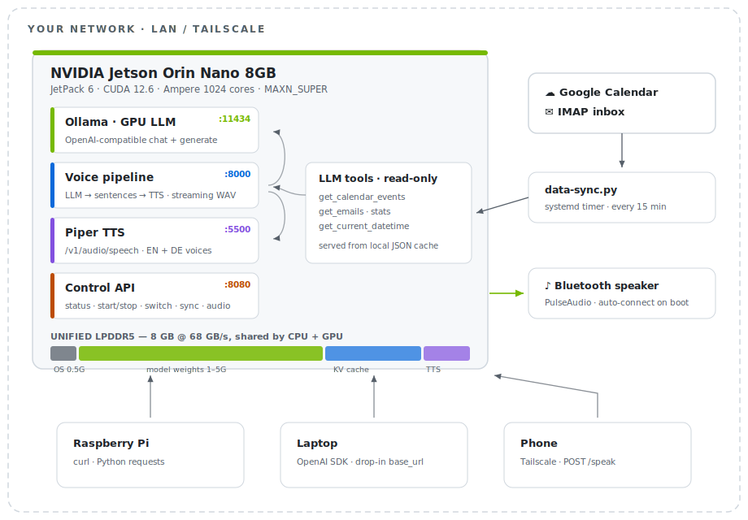

<div align="center">

# 🤖 Jetson Voice AI

### A fully local, voice-enabled AI assistant on a $250 board

**LLM inference · streaming text-to-speech · calendar & email agent · remote control API**
— all self-hosted on an NVIDIA Jetson Orin Nano 8GB, no cloud required.


*Ask it what's on your calendar. It checks. Then it talks back — through a Bluetooth speaker.*

</div>

---

## ✨ What's in the box

| | Feature | How |
|---|---|---|
| 🧠 | **Local LLM API** | Ollama on GPU, OpenAI-compatible, reachable from any device on your LAN |
| 🗣️ | **Streaming voice replies** | LLM tokens → sentence splitter → Piper TTS, audio starts before the answer is finished |
| 📅 | **Tool-calling agent** | The LLM reads your Google Calendar & IMAP inbox via a local cache — *"any emails that need a reply?"* |
| 🎛️ | **Remote control API** | Start/stop modes, hot-swap models, route audio, trigger syncs — from your phone via Tailscale |
| 🔊 | **Bluetooth speaker out** | Auto-connects on boot, answers play in the room, not just over HTTP |
| ⚡ | **One-command headless mode** | Kills the desktop, maxes the clocks, frees 1.5 GB for model weights |
| 🔁 | **Survives reboots** | systemd user services + a login boot menu, zero babysitting |
| 🔐 | **Optional API auth** | One env var (`VOICE_API_TOKEN`) locks every endpoint behind a bearer token |

## 🚦 Three modes, one script

```
./jetson-ai.sh start          →  🧠  local LLM API only          (max GPU for the model)
./jetson-ai.sh start voice    →  🧠 + 🗣️  local LLM + voice       (the full assistant)
./jetson-ai.sh start api      →  ☁️ + 🗣️  cloud LLM + local voice  (0.6 GB RAM, desktop stays on)
```

---

## 🏗️ Architecture

<picture>
  <source media="(prefers-color-scheme: dark)" srcset="assets/architecture-dark.svg">
  
</picture>

---

## 🚀 Quick Start

```bash
# 0. One-time: sudoers rules + Ollama performance drop-in (needs password once)
./jetson-ai.sh setup

# 1. Voice models (~240 MB, not in git)
bash voice/download-models.sh

# 2. Fire it up
./jetson-ai.sh start voice          # local LLM + TTS
./jetson-ai.sh status               # everything at a glance

# 3. Make it talk
curl -X POST http://<jetson-ip>:8000/voice/chat \
  -H "Content-Type: application/json" \
  -d '{"prompt":"Explain edge AI in one sentence.","voice":"en","output":"speaker"}'
```

Want it permanent? `./jetson-ai.sh install-services` — every component becomes a
systemd user service that starts on login and restarts on failure.

### 🗓️ The agent part

```bash
# One-time: Google OAuth (device flow, works headless) + IMAP creds
cp voice/config.template.env .voice_env    # fill in credentials
python3 voice/setup-google-auth.py

# Sync runs every 15 min via systemd timer, or on demand:
curl -X POST http://<jetson-ip>:8080/sync -d '{"target":"both"}'

# Now ask questions that need your data:
curl -X POST http://<jetson-ip>:8080/speak \
  -H "Content-Type: application/json" \
  -d '{"prompt":"What is on my calendar today, and do any emails need a reply?","use_tools":true}'
```

The LLM gets four **read-only** tools — `get_current_datetime`, `get_calendar_events`,
`get_emails`, `get_email_stats` — served from a local JSON cache. Your credentials
never touch the model, and nothing can write or send.

---

## 🎛️ Remote Control API (port 8080)

Control the whole box from anywhere on your tailnet:

| Endpoint | Does |
|---|---|
| `GET /status` | RAM, power mode, model, GPU%, BT, audio sinks — one call |
| `POST /speak` | `{prompt}` → Jetson answers out loud, returns transcript |
| `POST /control/start` `{mode}` | Boot a mode remotely (local / voice / api) |
| `POST /control/switch` `{model}` | Hot-swap the LLM (~20 s) |
| `PUT /control/sink` `{sink}` | Route audio: HDMI ↔ Bluetooth ↔ USB |
| `POST /bt/connect` | Connect BT speaker + auto-set as default sink |
| `POST /sync` | Refresh calendar/email cache |

🔐 Set `VOICE_API_TOKEN` in `.voice_env` and every endpoint (except `/health`)
requires `Authorization: Bearer <token>`.

---

## 📊 Model Guide

```
  MODEL SELECTION — RAM vs 8 GB LIMIT
  ═══════════════════════════════════════════════════════════════
  qwen3.5:0.8b       ██░░░░░░░░░░░░░░  1.0GB  ~35 tok/s  ✓
  qwen2.5:3b         █████░░░░░░░░░░░  1.9GB  ~22 tok/s  ✓
  llama3.2:3b        █████░░░░░░░░░░░  2.0GB  ~20 tok/s  ✓
  phi4-mini        ★ ██████░░░░░░░░░░  2.5GB  ~18 tok/s  ✓
  qwen3.5:2b         ███████░░░░░░░░░  2.7GB  ~20 tok/s  ✓
  gemma3             █████████░░░░░░░  3.3GB  ~12 tok/s  ✓
  qwen3.5:4b       ★ █████████░░░░░░░  3.4GB  ~13 tok/s  ✓
  gemma4:e2b-it-qat  ███████████░░░░░  4.3GB  ~ 9 tok/s  ✓  vision
  llama3.1:8b        █████████████░░░  4.9GB  ~ 8 tok/s  ○
  gemma4:e4b-it-qat  ███████████████░  6.1GB  ~ 6 tok/s  ○  vision
  gemma4:e2b (fp)    ████████████████  7.2GB  ~ 5 tok/s  ○  use -qat!
  gemma4:e4b (fp)    ██████████████████████  9.6GB  ✗ too large
                     ├────────┬───────┼──────────────────┤
                     0       2GB    4GB                 8GB

  ✓ fits always   ○ headless only   ✗ avoid (CPU fallback)   ★ recommended
```

> 💡 **The `-qat` trick.** Gemma 4's quantization-aware-training builds are the
> same model at ~60% of the RAM with near-identical quality:
> `gemma4:e2b-it-qat` is **4.3 GB vs 7.2 GB** — vision goes from "barely fits
> headless" to "fits comfortably", and `e4b-it-qat` (6.1 GB) fits headless where
> the full-precision 9.6 GB never did. Ollama's default tags are already
> Q4_K_M — the edge-optimal quantization — so avoid `q8` variants on 8 GB.

Task aliases route to the right model automatically:

```bash
./jetson-ai.sh start reasoning    # phi4-mini            math & logic
./jetson-ai.sh switch code        # qwen3.5:4b           coding
./jetson-ai.sh switch tiny        # qwen3.5:0.8b         ultra-fast, 1 GB
./jetson-ai.sh switch german      # discolm-german       deutsch, bitte
./jetson-ai.sh switch vision      # gemma4:e2b-it-qat    images, QAT
./jetson-ai.sh switch vision-max  # gemma4:e4b-it-qat    best vision (headless)
```

> ⚠️ **The silent CPU-fallback trap.** A model that doesn't fit in GPU RAM
> still *runs* — at 0.3 tok/s instead of 13–35. `./jetson-ai.sh bench` and
> `status` detect it and tell you before you waste an afternoon.

---

## ⚡ Why it's fast on 8 GB

Six stacked optimizations, applied automatically by `start`:

| # | Trick | Gain |
|---|---|---|
| 1 | `nvpmodel -m 2` + `jetson_clocks` (MAXN_SUPER) | ~2× clocks |
| 2 | Stop GNOME while serving | +1.5 GB for weights |
| 3 | `OLLAMA_FLASH_ATTENTION=1` | −30–50% KV cache |
| 4 | `OLLAMA_KV_CACHE_TYPE=q8_0` | KV cache halved again |
| 5 | `OLLAMA_KEEP_ALIVE=-1` | zero reload between requests |
| 6 | systemd drop-in | all of it survives reboots |

`./jetson-ai.sh stop` reverses everything — desktop back, power mode restored.

---

## 🔌 Use it like OpenAI

Drop-in compatible — point any OpenAI SDK at the Jetson:

```python
from openai import OpenAI

client = OpenAI(base_url="http://<jetson-ip>:11434/v1", api_key="ollama")
r = client.chat.completions.create(
    model="qwen3.5:4b",
    messages=[{"role": "user", "content": "Explain edge AI in 2 sentences."}],
)
print(r.choices[0].message.content)
```

Piper speaks OpenAI too — `POST :5500/v1/audio/speech` with `{"model":"en","input":"..."}`.

---

## 🖥️ Boot Menu

```bash
echo "source $(pwd)/boot-choice.sh" >> ~/.bashrc   # run from the repo root
```

```
  ╔══════════════════════════════════════════════╗
  ║         JETSON ORIN — BOOT MODE              ║
  ╠══════════════════════════════════════════════╣
  ║  [1] Ubuntu Desktop              ← last      ║
  ║  [2] AI API  — qwen3.5:4b                    ║
  ║  [3] AI API  — phi4-mini (fast)              ║
  ║  [4] AI API  — choose model                  ║
  ║  [5] Shell only (no desktop/AI)              ║
  ╚══════════════════════════════════════════════╝
  Auto-starting [1] in 10s ... (press 1-5 to change)
```

Remembers your last choice · skip once with `JETSON_AI_SKIP_MENU=1` · never shows inside desktop sessions.

---

## 🧪 Test Suite

```bash
./test-models.sh              # benchmark every installed model, flag CPU fallback
```

```
  Model                               Result
  ────────────────────────────────────────────────────────
  qwen2.5:3b                          ✓ PASS  22.1 tok/s  GPU:94%
  phi4-mini:latest                    ✓ PASS  18.3 tok/s  GPU:91%
  qwen3.5:4b                          ✓ PASS  13.1 tok/s  GPU:88%
  gemma4:e4b                          ✗ FAIL  CPU fallback (0.3 tok/s)
```

---

## 🩹 Troubleshooting

| Symptom | Fix |
|---|---|
| Scripts ask for sudo password | `./jetson-ai.sh setup` (one time) |
| `bench` shows < 2 tok/s | CPU fallback — `stop` then `start` to free RAM |
| Black screen after `stop` | `sudo systemctl start gdm3` |
| API unreachable from LAN | `systemctl show ollama \| grep OLLAMA_HOST` |
| No audio on speaker mode | `GET :8080/control/sinks`, then `PUT /control/sink` |
| Calendar/email tools say "cache empty" | `python3 voice/data-sync.py` or `POST :8080/sync` |

---

## 📁 Layout

```
jetson-ai.sh                 the controller — setup/start/stop/switch/bench/services
boot-choice.sh               login boot menu
test-models.sh               model test suite
voice/
├── voice-pipeline.py        :8000  LLM → sentence split → Piper, streaming WAV
├── piper-service.py         :5500  OpenAI-compatible TTS
├── control-api.py           :8080  remote control & status
├── tools.py                 LLM tool defs (calendar/email, read-only)
├── data-sync.py             Google Calendar + IMAP → local JSON cache
├── setup-google-auth.py     one-time OAuth device flow
├── sentence_splitter.py     streaming sentence-boundary detector (EN/DE)
├── download-models.sh       fetch Piper voices (~240 MB)
├── bt-connect.sh            Bluetooth speaker auto-connect
├── config.template.env      → copy to .voice_env, add credentials
└── systemd/                 user services + 15-min sync timer
```

State, logs, cache and recordings live in `~/.local/share/jetson-ai/`.

---

<div align="center">

**Hardware:** NVIDIA Jetson Orin Nano 8GB · JetPack 6.x · CUDA 12.6 · LPDDR5 68 GB/s

*Built for the shelf, not the cloud.* 🏠

</div>
